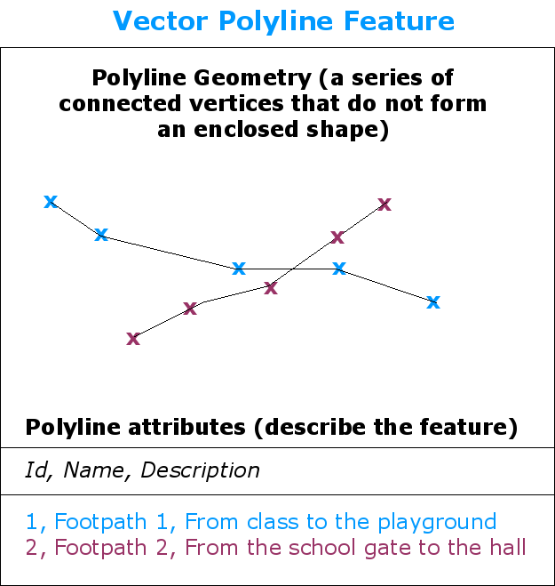
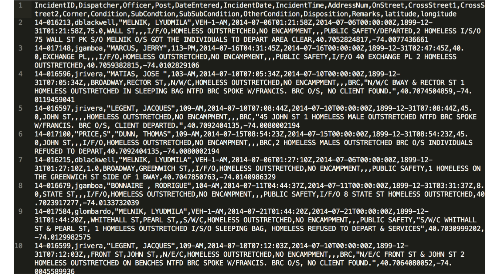
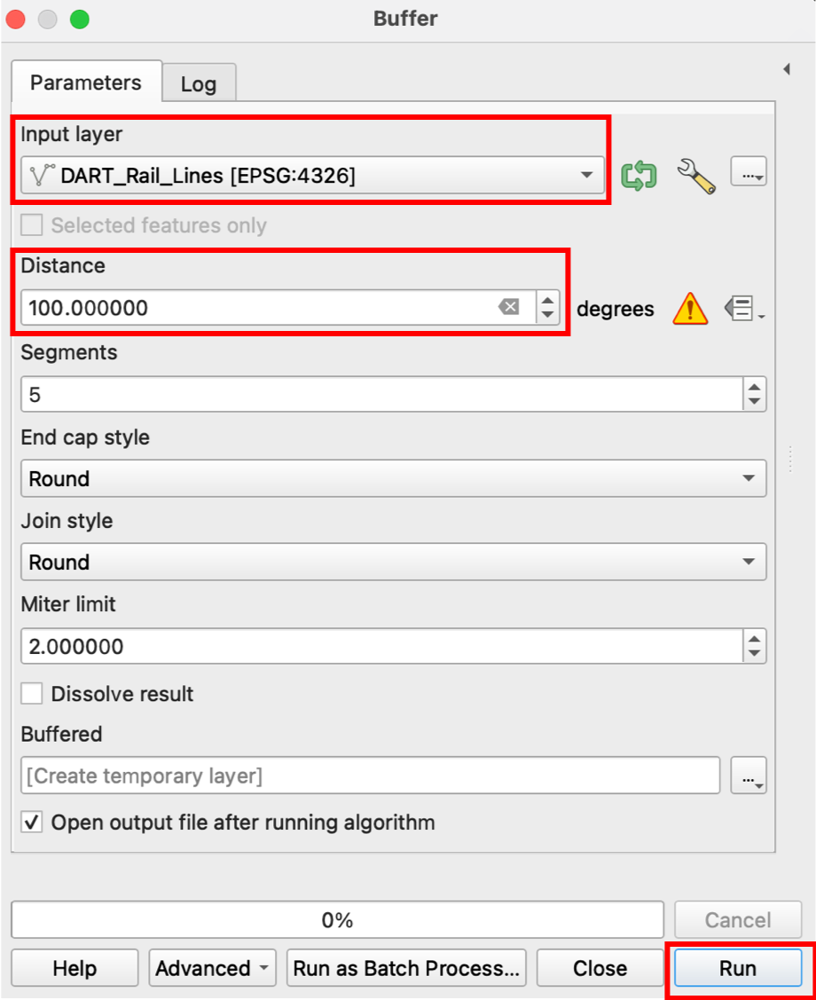
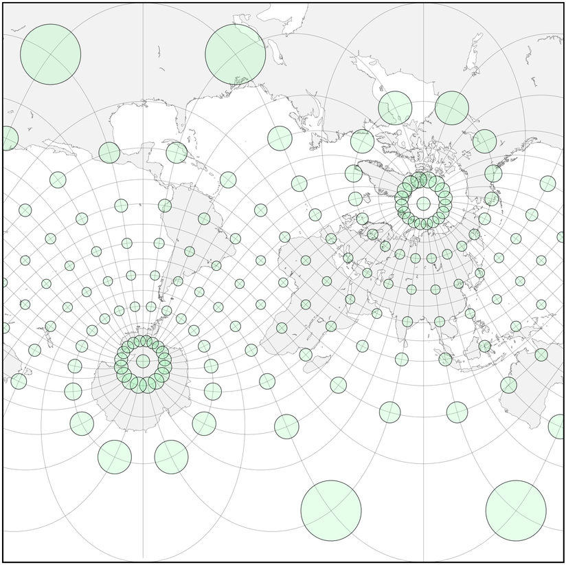
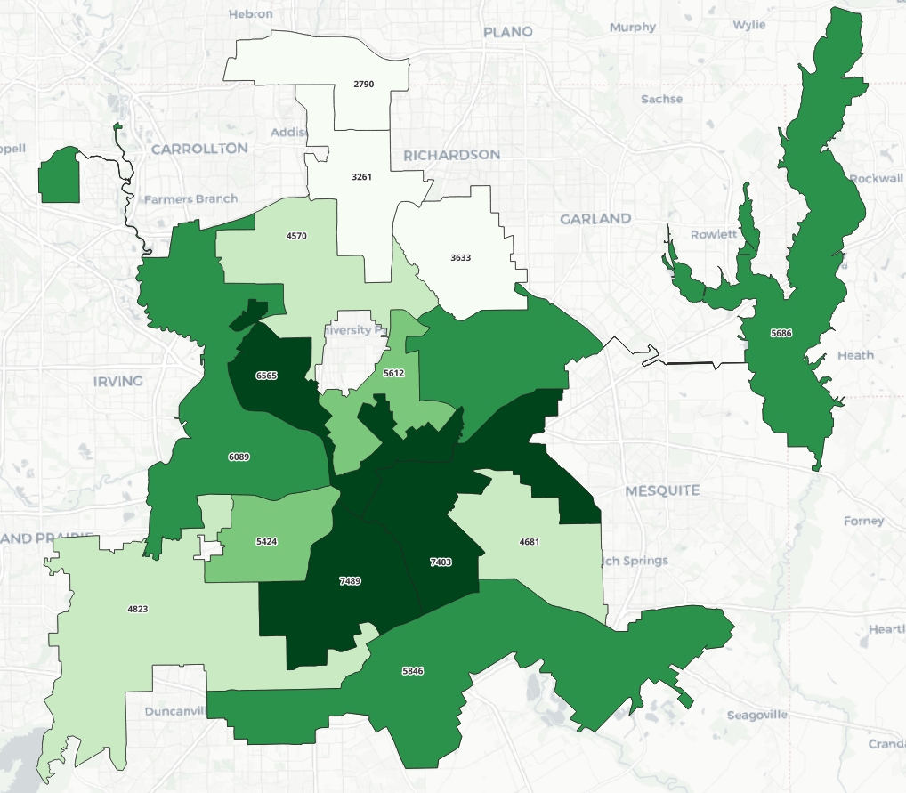
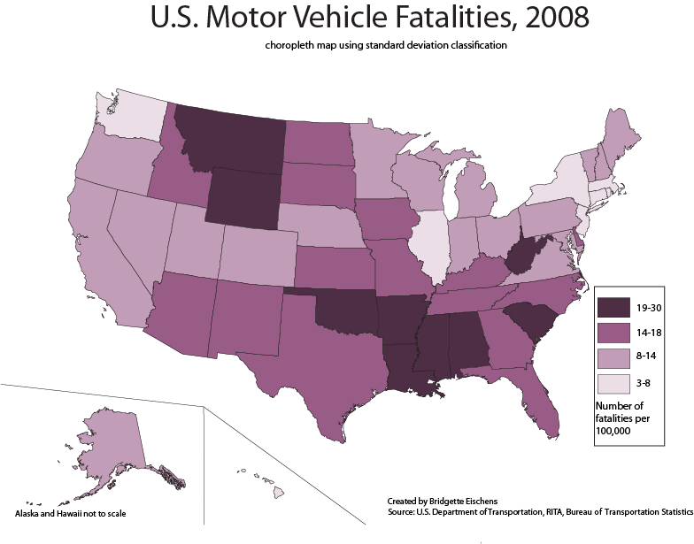
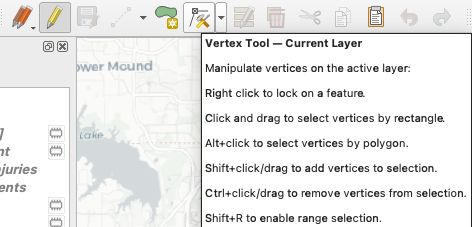
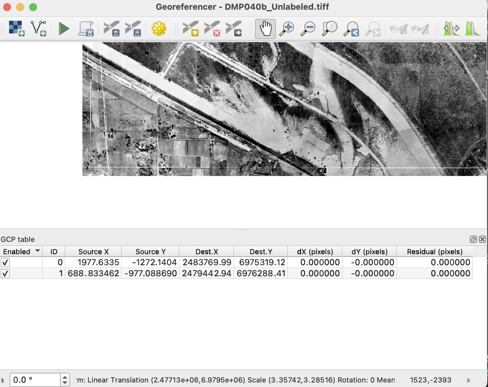

layout:true

  
  
QGIS for Working Professionals

  

    
    
      
      

--

class: center,middle

# QGIS for Working Professionals

- - -

## Facilitator: Richard Dunks

### Follow along at: https://bit.ly/qgis-working-pro

#### See the code at: https://bit.ly/qgis-working-pro-code

<strong><strong>QGIS for Working Professionals</strong></strong> by <a xmlns:cc="http://creativecommons.org/ns#" href="https://www.datapolitan.com" property="cc:attributionName" rel="cc:attributionURL">Richard Dunks</a> is licensed under a <a rel="license" href="http://creativecommons.org/licenses/by-sa/4.0/">Creative Commons Attribution-ShareAlike 4.0 International License</a>

---

class:center,middle
# Welcome!

---

# A Few Ground Rules
???
+ Facilitators establish the intention we have for the culture of the classroom

--

+ Be present (phone, email, social media, etc.)
--

+ Be curious and ask questions
--

+ Step up, step back
--

+ One mic
--

+ Respect multiple perspectives 
--

+ Assume noble regard and positive intent

---

# Introductions
In pairs, please share with your partner:
+ Your name
+ What you do
+ Your level of comfort with QGIS (1 - 10)
+ What you hope to get from class this week

You'll be introducing your partner to the class (so take notes)

---

# Assumptions
--

+ You're all busy
--

+ You're all mostly self-taught
--

+ You're all motivated to learn how to better use QGIS
--

+ You all know your data better than I could (and might want to take a break from it)

---
class:center,middle

# How We're Going to Do This

---

# How I Teach
--

+ Minimal lecture
--

+ Demonstrate a concept/technique with open data
--

+ Learn by doing -> You'll be sharing your screen more than me
--

+ I ask a lot of you but I will help out along the way
--

+ I leave no one behind
--

---
# How our Days Are Going to Go
--

+ 2 85-minute sessions
--

+ 10-minute break in between
--

+ "Your Turn" -> Practice exercise towards end of each block
--

+ "Peer Mapping" -> Work in pairs with one person driving
--

+ 1-hour open lab after our session is over for questions and additional help

---
name: day1-overview
# How the Class is going to go
--

+ [Day 1](#day1) - Introduction to QGIS, loading data, and filtering
--

+ [Day 2](#day2) - Selecting and buffering features, projections
--

+ [Day 3](#day3) - Spatial joins and the Print Composer
--

+ [Day 4](#day4) - Heatmaps and Hexagonial Binning, Creating and Editing Features, and Georeferencing

---

# Outcomes
--

At the end of this week, you will:
--

+ Understand foundational GIS concepts
--

+ Understand the purpose and functionality of a GIS
--

+ Be practiced using QGIS for a variety of spatial operations
--

+ Demonstrate proficiency in applying GIS concepts to real-world problems
--

+ Be familiar with key resources for further information on using QGIS

---

# Keep in Mind
--

+ We're going to start simple but will move quickly forward
--

+ I'll make sure it's interesting no matter your skill level
--

+ This is also an opportunity to help your colleagues

---
name: day1

# Topics for Today
--

+ Basic operations in QGIS (loading, styling, filtering, and exporting data)
--

+ Essential GIS definitions and concepts
--

+ Pro-tips for working with QGIS

---

# Let's Get Started

## [Download this data](data/dallas_council_districts.zip) and [unzip the file](https://www.filecenter.com/blog/how-to-unzip-files-mac-iphone-android-windows/)

???
Image of map we're going to create

---

# Let's Get Started

---

# Adding Data

???
1. Add Dallas Council districts

---

# Adding Data
--

+ Navigate to where you unzipped the file
--

+ Select the `.shp` file

--

+ Select .orange[**Open**]

---

# Adding Data

--

+ Select .orange[**Add**] to add the data
--

+ Select .orange[**Close**]

---

# Adding Data

---

# Attribute Table

---

# Attribute Table

---

# Attribute Table
+ Each feature has a corresponding row in the attribute table
--

+ When a feature is selected on the map, that row is selected in the attribute table
--

+ Features can be used to style the data

---

# Styling Features
--

+ Right click the layer and select .orange[**Properties**]

---

# Styling Features
+ In the Layer Properties window, click the .orange[**Symbology**] tab
--

+ Click the .orange[**Single Symbol**] and select .orange[**Categorized**] from the drop-down menu
--

---

# Styling Features
+ In the .orange[**Value**] field, select the column that has the data you want to style
--

+ In our case, this is the .orange[**district**] column
--

---

# Styling Features
+ Then click .orange[**Classify**] (bottom left)
--

--

+ This should give each unique value in the column its own color

---

# Styling Features
+ Click .orange[**OK**] (or .orange[**Apply**] to preview)

---
exclude:true
class:center,middle
# Let's See What You Have

---

# Add labels to data
--

+ In the Layer Properties window click the .orange[**Labels**] tab
--

+ Select .orange[**Single labels**]

---

# Add labels to data
--

+ Select the column that has the data you want to use for labels ("council")
--

+ Style the text however you want
--

---

# Add labels to data

---

class: center, middle
# What is our Map missing?

---

exclude:true
# Base Maps

####Image Source: [Wikimedia Commons](https://commons.wikimedia.org/wiki/File:Visual_Representation_of_Themes_in_a_GIS.jpg)

---
exclude:true
# Base Maps

---

# Base Maps

+ Give maps context (roads, topographical features, landmarks, etc.)
--

+ In QGIS, you need a plugin to use base maps
--

+ There are <a href="https://plugins.qgis.org/plugins/tags/basemap/?sort=downloads&order=desc" target=_blank>several</a>, but we're only going to use the most popular

---
name:install-qms
# Loading Base Maps in QGIS
+ From the Plugins menu, select .orange[**Manage and Install Plugins**]

---

# Loading Base Maps in QGIS

+ Search for the .orange[QuickMapServices plugin] and install it

---

# Setting Up QuickMapServices
+ Go to the .orange[Settings] menu

---

# Setting Up QuickMapServices

+ Get the contributed packs

---

# Setting Up QuickMapServices

+ Revel in all the beautiful base maps

---
exclude:true
class:center,middle
# Raise Your Hand When You Have All the Basemaps

---

# Loading Base Maps in QGIS
+ Take a moment and select the base map you want to use

---

# Loading Base Maps in QGIS

---

# QGIS Pro-tip
--

+ Save your project
--

+ .red[QGIS doesn't autosave]
--

+ .red[You will lose work when it crashes]
--

---

# Your Turn
Working with a peer, come up with a basic map with one data layer.
--

+ Think about styling and labeling
--

+ Be ready to show the group
--

+ Feel free to get creative with what you show

---

name: a-block-end
class:center,middle

# Wrap-up

---
class:center
# 10-Minute Break

#### Source: https://www.instagram.com/p/BmSmGcxhGGT/

---
name: b-block-start
class:center, middle

# Welcome Back

---

class:center,middle
# What did we just do?

---

class:center,middle
# Some Basic Concepts

---

# Geographic Info System (GIS)
--

> Any system for capturing, storing, checking, and displaying data related to positions on the Earth's surface

### [National Geographic Education Encyclopedia](https://www.nationalgeographic.org/encyclopedia/geographic-information-system-gis/)

---

# Or more simply

> In a GIS, you connect _**data**_ with _**geography**_.

### [GISgeography.com](http://gisgeography.com/what-gis-geographic-information-systems/)

---

# Geographic Info Systems (GIS)
--

+ Create interactive queries (user-created searches)
--

+ Analyze spatial information
--

+ Edit data in maps
--

+ Present the results of all these operations

---

class:center,middle
# Some More Key Concepts

---

# Basic Map Using QGIS

---

# Points  

--

---

# Lines

--

---

# Polygons

--

---

# Shapefiles
--
        
+ Basic file for storing map elements
--

+ Stores spatial data, like points, lines, and polygons
--

+ Multiple files comprise a "shapefile"

--

---

# Shapefiles

--

+ .orange[.shp]—The main file that stores the feature geometry
--

+ .orange[.dbf]—The dBASE table that stores the attribute information of features

---

# Shapefiles

+ .orange[.prj]—The file that stores the coordinate system information
--

+ .orange[.shx]—The index file that stores the index of the feature geometry

---

# You might also see
--

+ .orange[.cpg]—Identifies the character set to be used
--

+ .orange[.sbn] and .orange[.sbx]—The files that store the spatial index of the features

---

# Shapefiles

+ Have a few limitations
--

+ One geometry type (Point, Line, Polygon) per shapefile
--

+ So sometimes you end up with this:

---

# Shapefiles
--

+ Column names can only be letters, numbers, and underscores "_"
--

+ Column names can only be ten characters long

--

---

# Other File Formats
--

+ CSV files
--

+ GeoJSON
--

+ GeoTIFF/GeoPDF
--

+ Spatial database

---

class:center,middle
# Let's add another layer

---

# What is a CSV file?
--

---

# What is a CSV file?

---

# Dallas 311 Service Requests
+ [Download the data](data/20240101_20240229_dallas_311.csv) to your desktop

---

# Adding CSV Data

---

--

---

# Adding CSV Data
+ Make sure it found the .orange[latitude] and .orange[longitude] fields

---

# Adding CSV Data

---

# Layers

#### Image Source: [Wikimedia Commons](https://commons.wikimedia.org/wiki/File:Visual_Representation_of_Themes_in_a_GIS.jpg)

---

# Layer Ordering
--

+ Layers on top are drawn on top
--

+ Just drag and drop within the Layers Panel to change order
--

+ Try it now

---

# Filter and Query
+ We can filter the points based on the values in the attribute table

---

# Filter and Query
+ Right-click on the layer and select .orange[Filter] to open the Query Builder

--

---

# Filter and Query
+ Filter using the .orange[Service Request Type] field
+ Select .orange[All] under .orange[Values]

---

# Filter and Query

--

---

# Filter and Query

---

# Filter and Query

---

class:center,middle
# We can also filter by multiple conditions

---

# Multiple Conditions

--

---

# Multiple Conditions

---

# Exporting Data
--

+ Once we have a selection that we like, we can export it as it's own layer
--

+ Right-click on the layer
--

+ Select .orange[Export] -> .orange[Save Selected Features As...]

---

# Exporting Data
--

+ Name the file and click .orange[OK]
--

---
class:center,middle

# Some other useful functions

---

# Zoom to Layer

---

# Zoom Selection
--

+ Select the zoom on the toolbar
--

--

+ Draw a box around the area you want to zoom into
--

+ Click the icon to return to the previous map extent
--

---

# Pan Map
+ Select the hand tool to pan around the map

---

# Toolbars

--

+ Set of quick icons you can place on your window
--

+ You can adjust which ones are visible and where they are
--

+ They are great if you like to work using icons

---

# Panels

--

+ Panels are panes to your desktop window
--

+ Good for quickly accessing information
--

+ Depends on how cluttered you want your window to be
--

+ [See the documentation](https://docs.qgis.org/2.18/en/docs/user_manual/introduction/qgis_gui.html#panels) for more information

---

# Your Turn
--

+ Working in your pairs, select a dataset
--

+ Select points by both feature and location
--

+ See if they agree or if there's a discrepancy

---
exclude: true
# Homework
+ Create and style a basic map with data from the database
+ Play around with the styles and labels
+ Have fun and explore features
+ You can show the live map or export it to a PNG to demo

---
class:center,middle
# Wrap-up

---

class:center,middle
# Good Resources for Further Information

---

# GIS Stack Exchange

[GIS Stack Exchange](http://gis.stackexchange.com/)

---

# Learning QGIS

[Learning QGIS](https://www.packtpub.com/application-development/learning-qgis-20)

---

# QGIS Map Design

[QGIS Map Design](https://locatepress.com/book/qmd2)

---

# Other Documentation
+ [QGIS online manual Gentle GIS Introduction](https://docs.qgis.org/3.34/en/docs/gentle_gis_introduction/)
+ [QGIS Tutorials and Tips](https://www.qgistutorials.com/en/index.html)
+ [Free and Open Source GIS Ramblings](https://anitagraser.com/)

---

# Looking Ahead
--

+ Projections and why they're important
--

+ Buffering and selecting features
--

+ Spatial joins

---
name: b-block-end
class: center, middle

# Thank you!

---
class:center,middle

# Lab Time 

---

name: day2
class: center,middle
# Welcome Back!
## Link to Today's Slides:
## https://bit.ly/qgis-working-pro-day2
## Link to Today's Workbook: 
## https://bit.ly/qgis-working-pro-book2

---

# A Few Ground Rules
???
+ Facilitators establish the intention we have for the culture of the classroom

--

+ Be present (phone, email, social media, etc.)
--

+ Be curious and ask questions
--

+ Step up, step back
--

+ One mic
--

+ Respect multiple perspectives 
--

+ Assume noble regard and positive intent

---
name: day2-overview
# How the Class is going to go
+ ~~[Day 1](#day1) - Introduction to QGIS, loading data, and filtering~~
+ [Day 2](#day2) - Selecting and buffering features, projections
+ [Day 3](#day3) - Spatial joins and the Print Composer
+ [Day 4](#day4) - Heatmaps and Hexagonial Binning, Creating and Editing Features, and Georeferencing

---

# Topics we covered yesterday
--

+ What is a GIS and spatial data types (point, line, polygon)
--

+ Adding data (shapefile, CSV, connecting to a database)
--

+ Styling and labeling features
--

+ Filtering data
--

+ Exporting data

---

# Catching Up
1. Download the [Dallas City Council Districts](data/dallas_council_districts.zip) and unzip the file
2. Download the [Dallas 311 CSV file](data/20240101_20240229_dallas_311.csv) and load the data
3. [Install the QuickMapServices plugin](#install-qms) and load the contributed packs

---
class:center,middle
# What Do the new folks need to know about class?

---

# Topics for Today
--

+ Select features by attribute and location
--

+ Buffering and selecting features

---

# Filter and Query
+ We can filter the points based on the values in the attribute table

---

# Filter and Query
+ Right-click on the layer and select .orange[Filter] to open the Query Builder

--

---
class:center,middle
# Selecting Features

---

# Why Do we Select Features?
--

+ Inspect a particular features or group of features
--

+ Create a subset of the data for export
--

+ Selected features will be highlighted in the Attribute Table

---

# Manual Selection
--

+ Can select in the attribute table by clicking the feature
--

+ Then select .orange[Show Selected Features]

--

+ Then right-click the layer to .orange[Zoom to Selection]
--

---
class:center,middle
# You can also select features on the map

---

# Manual Selection
+ Use options in .orange[Edit] -> .orange[Select]

---

# Manual Selection
--

+ Or the toolbar

--

+ .orange[Select Feature(s)] is the one I most commonly use

---

# Select by Feature
--

+ Sometimes we don't want to filter, but just select based on attributes
--

+ We do this in the .orange[Attribute Table] (right click the layer and open)
--

+ Click on the icon in the top left with the <a href="https://en.wikipedia.org/wiki/Epsilon" target=_blank>backward 3</a>
--

???
(select noise complaints)

---

# Select by Feature
--

+ This will allow you to select by expression
--

+ Select the .orange[Fields and Values]
--

+ Select .orange[Service Request Type]
--

---

# Select by Feature
--

+ Add an .orange[=] sign to the expression
--

+ Filter the values for .orange[Noise]
--

+ Select .orange[Chronic Noise Complaint - DPD]
--

--

---

# Select by Feature
--

+ Click .orange[Select Features]
--

+ Check the top Attribute Table for the filtered row count

--

+ Filter to .orange[Show Selected Features]

---

# Select by Feature
+ The yellow dots are the selected features

---
# Select by Location
--

+ Sometimes we want to select based on where the feature is on the map
--

+ This helps when the spatial location isn't an attribute
--

+ It also helps verify the attribute is accurate
--

+ Let's practice this

---

# Select by Location
--

+ Select a council district from the .orange[Councils] layer
--

+ Go to .orange[Vector] -> .orange[Research Tools] -> .orange[Select by Location]

???
(select complaints in district)

---
# Select by Location
+ Add the parameters for the select

---
# Select by Location
+ Turns out the feature isn't accurate

---

# Your turn
--

+ Select data from your dataset
--

+ Try a .orange[Select Feature] expression or .orange[Select by Location]
--

+ What are you trying to accomplish? 
--

+ Did it work? 

---
name: c-block-end
class: center,middle

# Wrap-up

---

class:center,middle
# 10 Min Break

#### Source: <a href="https://www.instagram.com/p/Bo_W2MHB_Zp/" target="_blank">sadtopographies on Instagram</a>

---
name: d-block-start
class: center,middle

# Welcome back

---

# Buffering features
--

+ Sometimes it's helpful to draw a buffer around features to do a selection
--

+ Gives our points and lines some actual area (makes them more like polygons)
--

+ This allows us to select features that are close in the real world, but not exactly aligned on the map

---

# Let's Try It Now

--

+ Download [this data of Dallas bicycle lanes](data/bikeroute.zip)
--

+ Download [this data of bicyclist collisions](data/2012-2024_DallasBicyclistInjuries.csv)
--

&nbsp;

How many collisions happen on vs off bicycle lanes?

---

# Steps to Analyze
--

1. Create a 15ft buffer on the bicycle lanes
--

2. Select the collisions that fall within that buffer
--

3. Count the number of collisions vs the total number

---

# Create a 15ft buffer
+ Go to .orange[Vector] -> .orange[Geoprocessing Tools] -> .orange[Buffer...]

---

# Create a 15ft buffer
+ Specify the .orange[Input layer], the .orange[Distance], and the output file (under .orange[Buffered])

+ Click .orange[Run]

---

# Create a 15ft buffer
+ Notice the bike lanes now have a buffer around them

---

# Steps to Analyze
--

1. ~~Create a 15ft buffer on the bicycle lanes~~
2. Select the collisions that fall within that buffer
3. Count the number of collisions vs the total number

---

# Select Collisions in the Buffer

---

# Select Collisions in the Buffer

---

# Steps to Analyze
1. ~~Create a 15ft buffer on the bicycle lanes~~
2. ~~Select the collisions that fall within that buffer~~
3. Count the number of collisions vs the total number
--

---

# Let's try another buffer
--

+ How many 311 service requests occur within 100 feet of DART Rail Lines?
--

+ We'll need to first buffer the [DART Rail Lines](data/DART_Rail_Lines.zip)
--

+ Then select the 311 Service Requests within the buffer

---

# Buffering DART Rail Lines
+ Select .orange[Vector] -> .orange[Geoprocessing Tools] -> .orange[Buffer]

---

# Buffering DART Rail Lines

--

+ What happened?

---
# Projections
--

+ Convert location on the 3-dimensional Earth (**latitude** and **longitude**) to coordinates on a 2-dimensional map
--

+ A .orange[coordinate reference system] defines how the 2D map relates to the 3D spherical earth
--

+ Can be tricky but it's necessary

--

#### [Digital Coast Geozone](https://geozoneblog.wordpress.com/2012/05/22/happy-birthday-mercator/)

---

# Projections
+ Every projection distorts some part of your map

[FlowingData](http://flowingdata.com/2014/01/13/map-projections-illustrated-with-a-face/)

---

# Projections Matter
--

+ These circles are all the same size on the globe:

[Progonos](http://www.progonos.com/furuti/MapProj/Normal/CartProp/Distort/distort.html)

---

# Projections Matter
+ As are these:

[Progonos](http://www.progonos.com/furuti/MapProj/Normal/CartProp/Distort/distort.html)

---

# Projections Matter
+ And these:

[Progonos](http://www.progonos.com/furuti/MapProj/Normal/CartProp/Distort/distort.html)

---

# Projections Matter

---

# Projections
+ There are three main types of projections: a. cylindrical, b. conical, c. planar

.caption[[Source](https://docs.qgis.org/3.34/en/docs/gentle_gis_introduction/coordinate_reference_systems.html#figure-projection-families)]

---

# Mercator Projections
--

+ A common map projection
--

+ Makes geometries near poles look bigger than geometries near the equator
--

---

# UTM Projections
+ Universal Transverse Mercator
+ Divides Earth's surface into 60 zones, giving each it's own plane

.caption[By cmglee, STyx, Wikialine and Goran tek-en - World map nations.svg, CC BY-SA 4.0, https://commons.wikimedia.org/w/index.php?curid=84366980]

---

# Projections

+ For the most part we will work in **WGS 84** (latitude and longitude)
--

+ Around DFW, we use a more accurate projection **Texas North Central State Plane**
--

+ Make sure you know which you should be using

---

# Projections
+ Identified by unique IDs that make it easier to talk about them
--

+ WGS 84 is referred to as **EPSG:4326**
--

+ Texas North Central State Plane is referred to as **EPSG:2276**

---

# Map Units
--

+ Each CRS has an associated map unit
--

+ What do you think is the map unit for 4326?
--

+ We can reproject our data into another CRS (with the right map units)

---

# Reproject Data
+ To reproject from one CRS to another, export the data using the CRS you want

---
# Reproject Data
+ Select the CRS you want to use (may need to search if you aren't using it)

---
# Try Buffer Again

+ Click .orange[OK]

---
# Select by Location

---
# Your Turn
+ Using your data, buffer and select on some features
+ Check the projection before hand and decide whether you need to reproject
+ Explain what you did and why
???
Putting it all together

---

exclude: true
# Homework
+ Create something that involves a buffer and a selection
+ Show what you created and why you did it
+ Briefly describe how you did it

---
class:center,middle
# Wrap-Up

---

# Looking Ahead
--

+ Spatial joins
--

+ Print composer

---
name: d-block-end
class:center,middle
# Thank you!

---
class:center,middle

# Lab Time 

---
name: e-block-start
class:center,middle

# Welcome back!
## Link to Today's Slides:
## https://bit.ly/qgis-working-pro-day3
## Link to Today's Workbook: 
## https://bit.ly/qgis-working-pro-book3

---

# A Few Ground Rules
???
+ Facilitators establish the intention we have for the culture of the classroom

--

+ Be present (phone, email, social media, etc.)
--

+ Be curious and ask questions
--

+ Step up, step back
--

+ One mic
--

+ Respect multiple perspectives 
--

+ Assume noble regard and positive intent

---

exclude: true
class:center, middle
# Homework presentations

---
name: day3-overview
# How the Class is going to go
+ ~~[Day 1](#day1) - Introduction to QGIS, loading data, and filtering~~
+ ~~[Day 2](#day2) - Selecting and buffering features, projections~~
+ [Day 3](#day3) - Spatial joins and the Print Composer
+ [Day 4](#day4) - Heatmaps and Hexagonial Binning, Creating and Editing Features, and Georeferencing

---

# Topics we covered yesterday
--

+ Manually selecting data
--

+ Select by Feature
--

+ Select by Location
--

+ Buffering and select
--

+ Projections

---
name: day3

# Topics for Today
--

+ Spatial Joins
--

+ Print Composer

---

# Spatial Joins
--

+ Allow us to relate data from different layers
--

+ We join them by their location
--

+ Can be done .orange[Point to Polygon]
--

+ Can also be done .orange[Polygon to Point]
--

--

---

# Spatial Joins

--

+ A simple utility to count the points in a polygon
--

+ Limited in options but easier to use

---

# Spatial Joins

--

+ Join summary of features in one layer to another
--

+ Works like the .orange[Count Points in Polygon], but offers other functions (`sum`, `median`, etc.)
--

+ Useful if you're counting points in a polygon or other features

---

# Spatial Joins

--

+ Join feature from one layer to another
--

+ Useful if you're joining an attribute from on feature to another (one to many)
--

+ Especially polygon to point

---

# Spatial Joins

--

+ Also possible to join by field value
--

+ (Think `deal_id` or another unique identifier)

---

class:center,middle
# Let's Join some data

---

# Spatial Join
+ We'll aggregate the number of 311 Service Requests by Council District

---

# Spatial Join
+ We will do a spatial join of 311 Service Requests (points) to the Council Districts (polygon) using .orange[Count Points in Polygon]
--

+ We will then style the result
--

---

# Spatial Join

--

+ Select the .orange[Polygons] layer to join count
--

+ Select the .orange[Points] layer to count from
--

+ [Optional] Name the .orange[Count field name]
--

+ [Optional] Save the result as a file or leave a temporary layer
--

+ Click .orange[Run]

---

# Spatial Join
Style the resulting layer 

--

+ Select the .orange[Value]
--

+ [Optional] Add text to the .orange[Legend format]
--

+ Select .orange[Classify]
--

+ Select .orange[OK]

---

# Spatial Join
+ We can do the same with the .orange[Join attributes by location (summary)]
---

# Spatial Join
+ Select the field to summarize (`Unique Key`)
--

--

---

# Spatial Join
+ Select the function (`count`)
--

--

---

# Spatial Join
+ The count of incidents will be the last column of the resulting attribute table

---

# Spatial Join
+ If you get a `null` result, check your geometric predicates

---

# Geometric Predicates
+ Remember these?

--

+ Let's break these down

---

# Geometric Predicates

.caption[Source: https://docs.qgis.org/3.34/en/docs/user_manual/processing_algs/algs_include.html#geometric-predicates]

.orange[Intersect] - Returns true if share any portion of space (circles 1, 2, and 3)

---

# Geometric Predicates

.caption[Source: https://docs.qgis.org/3.34/en/docs/user_manual/processing_algs/algs_include.html#geometric-predicates]

.orange[Contain] - Returns true if no points of b are outside of a (circle 1)

???
Returns 1 (true) if and only if no points of b lie in the exterior of a, and at least one point of the interior of b lies in the interior of a. In the picture, no circle is returned, but the rectangle would be if you would look for it the other way around, as it contains circle 1 completely. This is the opposite of are within.

---

# Geometric Predicates

.caption[Source: https://docs.qgis.org/3.34/en/docs/user_manual/processing_algs/algs_include.html#geometric-predicates]

.orange[Disjoint] - Returns true if geometries don't share any space (circle 4)

---

# Geometric Predicates

.caption[Source: https://docs.qgis.org/3.34/en/docs/user_manual/processing_algs/algs_include.html#geometric-predicates]

.orange[Equal] - Returns true if geometries are exactly the same (no circles)

---

# Geometric Predicates

.caption[Source: https://docs.qgis.org/3.34/en/docs/user_manual/processing_algs/algs_include.html#geometric-predicates]

.orange[Touch] - Returns true if the geometries have at least one point in common, but their interiors do not intersect (circle 3)

---

# Geometric Predicates

.caption[Source: https://docs.qgis.org/3.34/en/docs/user_manual/processing_algs/algs_include.html#geometric-predicates]

.orange[Overlap] - Returns true if the geometries share space but are not completely contained by each other (circle 2)

---

# Geometric Predicates

.caption[Source: https://docs.qgis.org/3.34/en/docs/user_manual/processing_algs/algs_include.html#geometric-predicates]

.orange[Are Within] - Returns true if geometry a is completely inside geometry b (circle 1)
+ Doesn't seem to work the way it should, [at least on Mac](https://gis.stackexchange.com/q/319328/16883)

---

# Geometric Predicates

.caption[Source: https://docs.qgis.org/3.34/en/docs/user_manual/processing_algs/algs_include.html#geometric-predicates]

.orange[Cross] - Returns true if the geometries have some, but not all, interior points in common & the actual crossing is a lower dimension than the highest supplied geometry (no circles)
???
For example, a line crossing a polygon will cross as a line (true). Two lines crossing will cross as a point (true). Two polygons cross as a polygon (false). In the picture, 

---

# Spatial Join
--

+ We can do more than count
--

+ Let's sum the total number of injuries and deaths for each council district

---

# Spatial Join
+ Select the fields to summarize

---

# Spatial Join
+ Select the function to use (`sum`)

---

# Spatial Join

---

# Spatial Join
+ Remember the bicyclist injuries didn't have council districts?
--

+ We can use the .orange[Join attributes by location] to add that feature
--

+ This will add an additional field with the council district

???
+ Join the council district to the bicyclist injuries

---
# Join attributes by location
+ Select fields to add (`COUNCIL` & `DISTRICT`)

---
# Join attributes by location

---

# Spatial join
--

+ We were able to join with different CRSs
--

+ Sometimes the join will fail (return no results)
--

+ You'll need to reproject and then run the spatial join 

---
name: e-block-end
class: center,middle
# Wrap-Up

---
class:center,middle

# 10-min Break

.caption[Source: https://www.instagram.com/p/BPxXKKeg7nj/ ]

---
name: f-block-start
class: center,middle
# Welcome back!

---

class:center,middle
# Types of Maps

---

# General Reference Maps

--

+ Show important physical features of an area
--

+ Include natural and man-made features
--

+ Usually meant to help aid in the navigation or discovery of locations
--

+ Usually fairly simple
--

+ Can be stylized based on the intended audience (tourists vs locals)

---

class:center,middle

##### Source: http://nationalmap.gov/small_scale/printable/reference.html
---

# Thematic Maps

--

+ Focuses on a specific theme or subject area
--

+ Features on the map represent the phenomenon being mapped
--

+ Spatial features used for reference
---

##### Source: http://www.usna.usda.gov/Hardzone/ushzmap.html 

---

# Choropleth

##### Source: http://www.geogalot.com/myp-humanities/year-9/understanding-hazards/003---choropleth-mapping

---

# Choropleth

##### Source: http://www.floatingsheep.org/2012/07/church-or-beer-americans-on-twitter.html

---

# Area Cartogram

.caption[Electoral Votes by State]
##### Source: https://web.archive.org/web/20170125182411/http://training.fws.gov/courses/csp/csp7203/resources/Types_of_Maps_2013.pdf 

---

# Dorling Cartogram

.caption[Obesity by State]
##### Source: http://homes.cs.washington.edu/~jheer//files/zoo/ 

---

# Print Composer
--

+ How you make exportable and printable maps in QGIS
--

+ Able to add map elements (legends, scales, text, etc)
--

---

# Create a new print composer

--

---

# print composer
## You are greeted with a blank slate

---

# print composer
## Add New Map adds to your current map

--

---

# print composer
## Customize item properties on the right

---

# Print Composer
## Don't forget a title and your sources

---

# Print Composer
## Export options

---

# Print Composer
## You can share your map or print it

---

# Print Composer 
## Problems you might encounter
--

+ Map extent -> "Use current map extent"
--

+ Moving map around -> Adjust with arrows
--

+ "North" arrow -> need to manually align

---
exclude: true
# Homework
+ Using your data, make a map with the Print Composer
+ Try a spatial join as part of the data

---
class:center,middle
# Wrap-up
---

# Looking Ahead
--

+ Creating and editing features
--

+ Checking for validity
--

+ Georeferencing images
--

+ Anything else?

---
name: f-block-end
class: center,middle

# Thank you!

---
class:center,middle

# Lab Time 

---

name: g-block-start
class: center,middle
# Welcome back!
## Link to Today's Slides:
## https://bit.ly/qgis-working-pro-day4
## Link to Today's Workbook: 
## https://bit.ly/qgis-working-pro-book4

---

# A Few Ground Rules
???
+ Facilitators establish the intention we have for the culture of the classroom

--

+ Be present (phone, email, social media, etc.)
--

+ Be curious and ask questions
--

+ Step up, step back
--

+ One mic
--

+ Respect multiple perspectives 
--

+ Assume noble regard and positive intent

---
exclude: true
class:center, middle

# Homework presentations

---
name: day4-overview
# How the Class is going to go
+ ~~[Day 1](#day1) - Introduction to QGIS, loading data, and filtering~~
+ ~~[Day 2](#day2) - Selecting and buffering features, projections~~
+ ~~[Day 3](#day3) - Spatial joins and the Print Composer~~
+ [Day 4](#day4) - Heatmaps and Hexagonial Binning, Creating and Editing Features, and Georeferencing

---

# Topics We Covered Yesterday
--

+ Spatial Joins
--

+ Print Composer

---
name: day4

# Topics for Today
--

+ Heatmaps and Hexagonial Binning
--

+ Creating and Editing Features
--

+ Validating Geometries
--

+ Vector vs Raster
--

+ Georeferencing

---

# Heatmaps

--

+ One way of mapping density when you have many points
--

+ An alternative to choropleth maps if you want to show a little more nuance

---

# Heatmaps in QGIS
--

+ Style the map using the Heatmap option
--

--

---

# Heatmaps in QGIS
+ Result for Dallas 311 data

---

# Heatmaps in QGIS (Alternative)
--

1. Use .orange[Heatmap (Kernel Density Estimation)] script in the Processing Toolbox
--

--

2. Create a raster (image) showing the density of the points
--

3. Style the raster
--

## Checkout [this tutorial](https://www.qgistutorials.com/en/docs/3/creating_heatmaps.html) on heatmaps

---

# Why I don't like heatmaps

--

+ Hard to make -> always adjusting the parameters
--

+ Hard to explain -> what's the difference between color layers?
--

+ Hard to say it's accurate -> just making it look pretty

---

# Some Examples of What I Mean

---

# Some Examples of What I Mean

---

# Hexagonal Binning
--

+ Shows density of point features
--

+ Accounts for points on top of each other
--

+ Basically a spatial histogram
--

+ Simple to use the .orange[Count Points in Polygon] function
--

+ Use a graduated color styling to show the concentration of points

---

# Hexagonal Binning
--

1. Create a grid layer of hexagonal polygons
--

2. Count the points in each polygon
--

3. Style the result

---

# Hexagonal Binning
--

+ We're going to create a density map of 311 requests
--

+ Make sure you have the [Dallas 311 data](data/20240101_20240229_dallas_311.csv)
--

---

# Create the hexagon grid
--

+ .orange[Vector] -> .orange[Research Tools] -> .orange[Create grid...]
--

---

# Create the hexagon grid
--

+ Select the bin size -> smaller is going to mean more processing time 
--

+ Might dilute the concentration
--

+ I chose 1000 feet

---

# Create the hexagon grid

---

# Join the Points
--

+ .orange[Count Points in Polygon]
--

+ Works faster when the projections are the same
--

+ Mine took 38 minutes to generate to join

---

# Style the Result
+ Use a graduated color scale in .orange[Symbology]

---

# Style the Result

---

# Your Turn
+ Do this with the [Dallas bicyclist injuries](data/2012-2024_DallasBicyclistsInjuries.csv)
+ You can reuse the hexagonal grid you created
+ Style the result to show the concentration

---

# Creating and Editing Data
--

+ Sometimes we need to create our own data
--

+ Sometimes we need to fix the data of others
--

+ We do this using the editing features
--

--

---

# Let's Create Some Data
--

+ Find a satellite basemap layer
--

+ Zoom in on our location here
--

+ We're going to map the building footprints using satellite imagery
--

+ We'll check your geometry at the end to make sure you did it right

---

# Creating feature layer
--

+ You can easily create your own layer
--

+ Go to .orange[Layer] -> .orange[Create Layer]
--

+ Select the type of layer you want to create
--

---

# Creating feature layer
--

+ Provide a .orange[File name]
--

+ Select .orange[File encoding]
--

+ Select the .orange[Geometry Type]
--

--

+ We'll be using .orange[Polygon]

---

# Creating feature layer
--

--

+ Specify the attributes (`id` will be there by default)
--

+ Think about what attributes you want to use for your data

---

# Creating feature layer
--

+ Have to specify the data type for each feature
--

+ Not all numbers need to be `Integer`
--

+ ZIP Codes are a good example of this
--

+ Numbers can be `Text` too

---

# Creating feature layer
--

+ Click .orange[Add Polygon Feature]

--

+ Use the .orange[Vertex Tool] to mark the vertices

--

+ When you're done, you'll need to add the attribute information

---

# Editing features
--

+ Sometimes we need to go in and adjust the features on a layer
--

+ We have to turn on editing
--

+ We can use the .orange[Vertex Tool] to edit the points
--

+ Save the result once you're done
--

+ And you can rollback changes if you make a mistake

---

# Digital Snapping
--

+ When you're creating lines that you want to butt against each other, snapping can help
--

+ QGIS will automatically snap them to each other
--

+ You can turn on and configure this in .orange[Settings] -> .orange[Options...] -> .orange[Digitizing]

---

# Valid geometries
--

+ To be valid, geometries must abide by certain rules
--

+ Anything that violates these rules is considered invalid
--

+ This prevents some algorithms from running properly
--

+ Here are <a href="https://support.safe.com/s/article/invalid-ogc-geometry-examples" target="_blank">some types of invalid geometries</a>

---

# Checking for valid geometries
+ Go to .orange[Vector] -> .orange[Geometry Tools] -> .orange[Check Validity]

---

# Checking for valid geometries
+ Put your layer into the .orange[Input layer] and see if your geometries are valid

---

# Fixing valid geometries
--

+ QGIS has a .orange[Fix geometries] function

--

+ This will take care of minor issues
--

+ Otherwise you have to manually edit the vertices

---

# Your Turn
--

+ Download [this file](data/Structures.zip) and run the validity checker on it
--

+ Identify the invalid geometries and fix them
--

+ What were the errors and what did you need to do in order to fix them?

---
name: g-block-end
class:center,middle
# Wrap-up

---
class:center,middle
# 10-Minute Break

.caption[Source: https://www.instagram.com/p/BgFrJ8OlRbE/]

---
name: h-block-start
class:middle,center

# Welcome Back!

---

# Types of Layers
--

+ .orange[Vector] - Collection of coordinates (x,y,z) that represent points on the map
--

+ .orange[Raster] - Matrix of pixels that covers the whole earth with some value (think basemap)
--

+ The features we've been working with have been vectors
--

+ A heatmap is a type of raster
--

+ So is what we're about to talk about 

---

# Georeferencing
--

+ Process of taking a digital image and providing geographic information so it can be mapped
--

+ Usually using satellite or aerial imagery
--

+ Can also georeference images of maps ([plat maps](https://en.wikipedia.org/wiki/Plat), surveys, etc.)
--

+ Process of plotting known points on the image for QGIS to use in calculating the other points
--

+ Result is a raster map just like our base maps

---

# Key things to keep in mind
--

+ More points are better than fewer
--

+ Good points are better than bad ones
--

+ Try to get at least 4 points
--

+ I try to spread them around the image
--

+ Any other pointers?

---

# Let's turn back the clock
--

+ [Click to download this aerial image from 1930](images/DMP040b_Unlabeled.tiff)
--

+ This is part of an aerial survey done by Fairchild Aerial Surveys, Inc.
--

+ Image is available thanks to Foscue Map Collection, SMU Libraries
--

+ We're going to make this a base map

---

# Quick Tip
--

+ Have satellite imagery up as your basemap
--

+ Also add Google Labels so you have the street names handy on top of the imagery

---
# Georeferencing in QGIS
+ Go to .orange[Layer] -> .orange[Georeferencer]

---

# Georeferencing in QGIS

--

+ Click on the .orange[Open raster...] button (top left)
--

+ Navigate to the image you downloaded

---

# Georeferencing in QGIS
--

+ Click .orange[Add point] and click on a reference feature where you have coordinates
--

+ A new window will come up to enter the coordinates
--

--

+ Click .orange[From Map Canvas] to be taken to your QGIS window

---

# Georeferencing in QGIS
--

+ These points (called ground control points) will appear in the pane at the bottom
--

+ The `Residual` lets you know how much error there is
--

--

+ Try to keep this low

---

# Georeferencing in QGIS
--

+ Once you're done, click the .orange[Start Georeferencing] button (green triangle)
--

+ This will run the operation to map georeference the image and load it into QGIS

???
Issues with Georeferencer: https://gis.stackexchange.com/questions/169882/qgis-georeferencer-failing-to-compute-transform
---

# Your Turn
+ [Click to download this image](images/dallas-texas-census-enumeration_districts-1940-5.jpeg) and run .orange[Georeferencer] on it
+ What is different about georeferencing this image?

---
name: h-block-end
class:center,middle

# Wrap-up

---

# Some things we didn't get to
--

+ [Geocoding addresses](https://guides.library.ucsc.edu/DS/Resources/QGIS)
--

+ Normalizing data for choropleths ([see this video](https://www.youtube.com/watch?v=t1RvSxNcafU))
--

+ [Automating map creation using Atlas](https://docs.qgis.org/3.34/en/docs/training_manual/forestry/forest_maps.html#ls-creating-detailed-maps-with-the-atlas-tool)
--

+ [Working with PostGIS SQL](https://postgis.net/workshops/postgis-intro/)
--

+ [Automating work with Python](https://docs.qgis.org/3.34/en/docs/user_manual/plugins/python_console.html#console)

---

# formats we haven't covered
+ JSON (used in online services)

---

# formats we haven't covered

+ GeoJSON (used in online services with locations to be mapped)
+ For more information see Eric Brelsford's [GeoJSON and Github tutorial](http://youtu.be/TQs7fYo9d_M)

---

# formats we haven't covered
+ XML (Google Earth's native data format)

---
class: center,middle
# Resources

---

# GIS Stack Exchange

[GIS Stack Exchange](http://gis.stackexchange.com/)

---

# Learning QGIS

[Learning QGIS](https://www.packtpub.com/application-development/learning-qgis-20)

---

# Discover QGIS 3.x

[Discover QGIS 3.x](https://locatepress.com/book/dq32)

---

# QGIS Map Design

[QGIS Map Design](https://locatepress.com/book/qmd2)

---

# Other Documentation
--

+ [QGIS online manual Gentle GIS Introduction](https://docs.qgis.org/3.34/en/docs/gentle_gis_introduction/)
--

+ [QGIS Tutorials and Tips](https://www.qgistutorials.com/en/index.html)
--

+ [Free and Open Source GIS Ramblings](https://anitagraser.com/)

---

# Reminders
--

+ Know your layer CRS
--

+ When in doubt, zoom in and then zoom out
--

+ If you’re working with a CSV file and run into an error, export as a shapefile and try it again
--

+ Save your project often
--

+ Choose good file names

---

# Final Thoughts
--

+ Practice what you've learned
--

+ There's always more to know
--

 (And then the next version will change everything on you)
--

+ Manage your data well and you'll be happier
--

+ Continue the collaboration and cooperation and you'll be just fine

---

# Contact Information
+ [Email me](mailto:richard[at]datapolitan[dot]com)
+ Connect on [LinkedIn](https://www.linkedin.com/in/richarddunks/)

---

class:middle,center
# Thank You!

