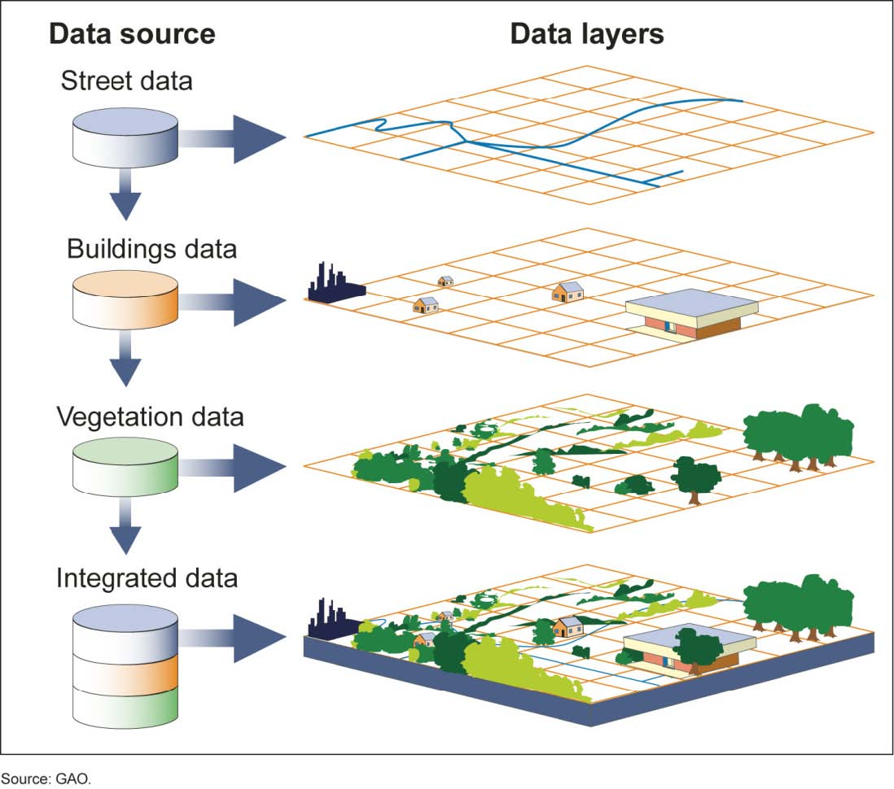
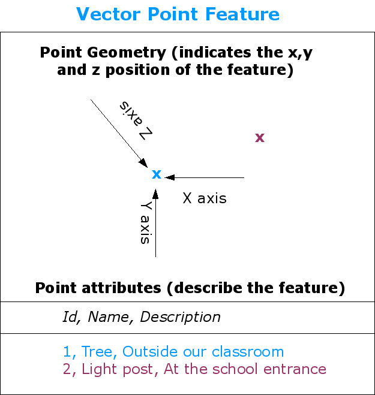
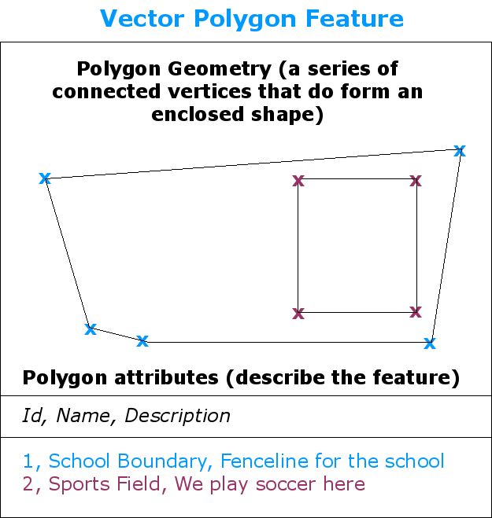
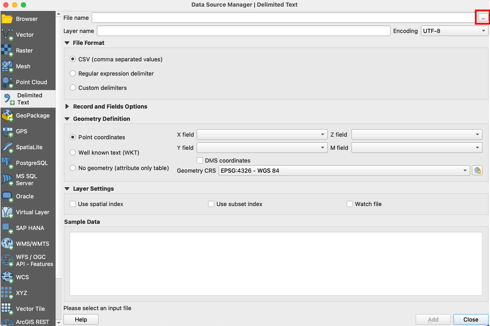
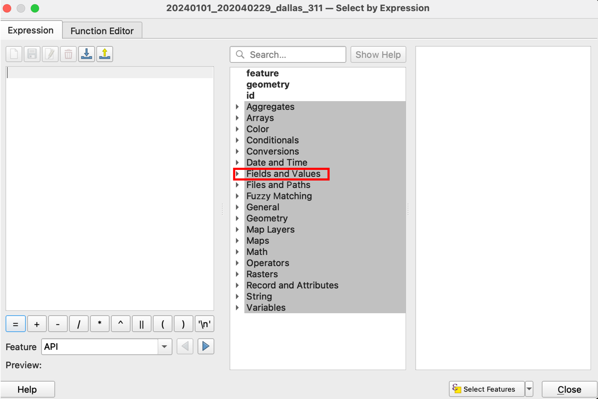

layout:true

  
  
QGIS for Working Professionals

  

    
    
      
      

--

class: center,middle

# QGIS for Working Professionals

- - -

## Facilitator: Richard Dunks

### Follow along at: 

#### See the code at: 

<strong><strong>QGIS for Working Professionals</strong></strong> by <a xmlns:cc="http://creativecommons.org/ns#" href="https://www.datapolitan.com" property="cc:attributionName" rel="cc:attributionURL">Richard Dunks</a> is licensed under a <a rel="license" href="http://creativecommons.org/licenses/by-sa/4.0/">Creative Commons Attribution-ShareAlike 4.0 International License</a>

---

class:center,middle
# Welcome!

---

# A Few Ground Rules
???
+ Facilitators establish the intention we have for the culture of the classroom

--

+ Be present (phone, email, social media, etc.)
--

+ Be curious and ask questions
--

+ Step up, step back
--

+ One mic
--

+ Respect multiple perspectives 
--

+ Assume noble regard and positive intent

---

# Introductions
In pairs, please share with your partner:
+ Your name
+ What you do
+ Your level of comfort with QGIS (1 - 10)
+ What you hope to get from class this week

You'll be introducing your partner to the class (so take notes)

---

# Assumptions
--

+ You're all busy
--

+ You're all mostly self-taught
--

+ You're all motivated to learn how to better use QGIS
--

+ You all know your data better than I could (and might want to take a break from it)

---
class:center,middle

# How We're Going to Do This

---

# How I Teach
--

+ Minimal lecture
--

+ Demonstrate a concept/technique with open data
--

+ Learn by doing -> You'll be sharing your screen more than me
--

+ I ask a lot of you but I will help out along the way
--

+ I leave no one behind
--

---
# How our Days Are Going to Go
--

+ 2 85-minute sessions
--

+ 10-minute break in between
--

+ "Your Turn" -> Practice exercise towards end of each block
--

+ "Peer Mapping" -> Work in pairs with one person driving
--

+ "Homework" -> A 10-15 minute task to demo the next day
--

+ 1-hour open lab after our session is over for questions and additional help

---

# How the Week is going to look
--

+ .orange[Monday] - Introduction to QGIS, loading data, filtering, and selecting
--

+ .orange[Tuesday] - Projections, buffering features, spatial joins
--

+ .orange[Wednesday] - Creating and editing features, validating geometries
--

+ .orange[Thursday] - Georeferencing and a "Bonus" section

---

# Outcomes
--

At the end of this week, you will:
--

+ Understand foundational GIS concepts
--

+ Understand the purpose and functionality of a GIS
--

+ Be practiced using QGIS for a variety of spatial operations
--

+ Demonstrate proficiency in applying GIS concepts to real-world problems
--

+ Be familiar with key resources for further information on using QGIS

---

# Keep in Mind
--

+ We're going to start simple but will move quickly forward
--

+ I'll make sure it's interesting no matter your skill level
--

+ This is also an opportunity to help your colleagues

---

# Topics for Today
--

+ Basic operations in QGIS (loading, styling, filtering, and exporting data)
--

+ Essential GIS definitions and concepts
--

+ Pro-tips for working with QGIS

---

# Let's Get Started

## [Download this data](data/dallas_council_districts.zip) and [unzip the file](https://www.filecenter.com/blog/how-to-unzip-files-mac-iphone-android-windows/)

???
Image of map we're going to create

---

# Let's Get Started

---

# Adding Data

???
1. Add Dallas Council districts

---

# Adding Data
--

+ Navigate to where you unzipped the file
--

+ Select the `.shp` file

--

+ Select .orange[**Open**]

---

# Adding Data

--

+ Select .orange[**Add**] to add the data
--

+ Select .orange[**Close**]

---

# Adding Data

---

# Attribute Table

---

# Attribute Table

---

# Attribute Table
+ Each feature has a corresponding row in the attribute table
--

+ When a feature is selected on the map, that row is selected in the attribute table
--

+ Features can be used to style the data

---

# Styling Features
--

+ Right click the layer and select .orange[**Properties**]

---

# Styling Features
+ In the Layer Properties window, click the .orange[**Symbology**] tab
--

+ Click the .orange[**Single Symbol**] and select .orange[**Categorized**] from the drop-down menu
--

---

# Styling Features
+ In the .orange[**Value**] field, select the column that has the data you want to style
--

+ In our case, this is the .orange[**district**] column
--

---

# Styling Features
+ Then click .orange[**Classify**] (bottom left)
--

--

+ This should give each unique value in the column its own color

---

# Styling Features
+ Click .orange[**OK**] (or .orange[**Apply**] to preview)

---
exclude:true
class:center,middle
# Let's See What You Have

---

# Add labels to data
--

+ In the Layer Properties window click the .orange[**Labels**] tab
--

+ Select .orange[**Single labels**]

---

# Add labels to data
--

+ Select the column that has the data you want to use for labels ("council")
--

+ Style the text however you want
--

---

# Add labels to data

---

class: center, middle
# What is our Map missing?

---

exclude:true
# Base Maps

####Image Source: [Wikimedia Commons](https://commons.wikimedia.org/wiki/File:Visual_Representation_of_Themes_in_a_GIS.jpg)

---
exclude:true
# Base Maps

---

# Base Maps

+ Give maps context (roads, topographical features, landmarks, etc.)
--

+ In QGIS, you need a plugin to use base maps
--

+ There are <a href="https://plugins.qgis.org/plugins/tags/basemap/?sort=-downloads" target=_blank>several</a>, but we're only going to use the most popular

---

# Loading Base Maps in QGIS
+ From the Plugins menu, select .orange[**Manage and Install Plugins**]

---

# Loading Base Maps in QGIS

+ Search for the .orange[QuickMapServices plugin] and install it

---

# Setting Up QuickMapServices
+ Go to the .orange[Settings] menu

---

# Setting Up QuickMapServices

+ Get the contributed packs

---

# Setting Up QuickMapServices

+ Revel in all the beautiful base maps

---
exclude:true
class:center,middle
# Raise Your Hand When You Have All the Basemaps

---

# Loading Base Maps in QGIS
+ Take a moment and select the base map you want to use

---

# Loading Base Maps in QGIS

---

# QGIS Pro-tip
--

+ Save your project
--

+ .red[QGIS doesn't autosave]
--

+ .red[You will lose work when it crashes]
--

---

# Your Turn
Working with a peer, come up with a basic map with one data layer.
--

+ Think about styling and labeling
--

+ Be ready to show the group
--

+ Feel free to get creative with what you show

---

name: a-block-end
class:center,middle

# Wrap-up

---
class:center
# 10-Minute Break

#### Source: https://www.instagram.com/p/BmSmGcxhGGT/

---
name: b-block-start
class:center, middle

# Welcome Back

---

class:center,middle
# What did we just do?

---

class:center,middle
# Some Basic Concepts

---

# Geographic Info System (GIS)
--

> Any system for capturing, storing, checking, and displaying data related to positions on the Earth's surface

### [National Geographic Education Encyclopedia](https://www.nationalgeographic.org/encyclopedia/geographic-information-system-gis/)

---

# Or more simply

> In a GIS, you connect _**data**_ with _**geography**_.

### [GISgeography.com](http://gisgeography.com/what-gis-geographic-information-systems/)

---

# Geographic Info Systems (GIS)
--

+ Create interactive queries (user-created searches)
--

+ Analyze spatial information
--

+ Edit data in maps
--

+ Present the results of all these operations

---

class:center,middle
# Some More Key Concepts

---

# Basic Map Using QGIS

---

# Points  

--

---

# Lines

--

---

# Polygons

--

---

# Shapefiles
--
        
+ Basic file for storing map elements
--

+ Stores spatial data, like points, lines, and polygons
--

+ Multiple files comprise a "shapefile"

--

---

# Shapefiles

--

+ .orange[.shp]—The main file that stores the feature geometry
--

+ .orange[.dbf]—The dBASE table that stores the attribute information of features

---

# Shapefiles

+ .orange[.prj]—The file that stores the coordinate system information
--

+ .orange[.shx]—The index file that stores the index of the feature geometry

---

# You might also see
--

+ .orange[.cpg]—Identifies the character set to be used
--

+ .orange[.sbn] and .orange[.sbx]—The files that store the spatial index of the features

---

# Shapefiles

+ Have a few limitations
--

+ One geometry type (Point, Line, Polygon) per shapefile
--

+ So sometimes you end up with this:

---

# Shapefiles
--

+ Column names can only be letters, numbers, and underscores "_"
--

+ Column names can only be ten characters long

--

---

# Other File Formats
--

+ CSV files
--

+ GeoJSON
--

+ GeoTIFF/GeoPDF
--

+ Spatial database

---

class:center,middle
# Let's add another layer

---

# What is a CSV file?
--

---

# What is a CSV file?

---

# Dallas 311 Service Requests
+ [Download the data](data/20240101_20240229_dallas_311.csv) to your desktop

---

# Adding CSV Data

---

--

---

# Adding CSV Data
+ Make sure it found the .orange[latitude] and .orange[longitude] fields

---

# Adding CSV Data

---

# Layers

#### Image Source: [Wikimedia Commons](https://commons.wikimedia.org/wiki/File:Visual_Representation_of_Themes_in_a_GIS.jpg)

---

# Layer Ordering
--

+ Layers on top are drawn on top
--

+ Just drag and drop within the Layers Panel to change order
--

+ Try it now

---

# Filter and Query
+ We can filter the points based on the values in the attribute table

---

# Filter and Query
+ Right-click on the layer and select .orange[Filter] to open the Query Builder

--

---

# Filter and Query
+ Filter using the .orange[Service Request Type] field
+ Select .orange[All] under .orange[Values]

---

# Filter and Query

--

---

# Filter and Query

---

# Filter and Query

---

class:center,middle
# We can also filter by multiple conditions

---

# Multiple Conditions

--

---

# Multiple Conditions

---

# Select by Feature
--

+ Sometimes we don't want to filter, but just select based on attributes
--

+ We do this in the .orange[Attribute Table] (right click the layer and open)
--

+ Click on the icon in the top left with the backward 3
--

???
(select noise complaints)

---

# Select by Feature
--

+ This will allow you to select by expression
--

+ Select the .orange[Fields and Values]
--

+ Select .orange[Service Request Type]
--

---

# Select by Feature
--

+ Add an .orange[=] sign to the expression
--

+ Filter the values for .orange[Noise]
--

+ Select .orange[Chronic Noise Complaint - DPD]
--

--

---

# Select by Feature
--

+ Click .orange[Select Features]
--

+ Check the top Attribute Table for the filtered row count

--

+ Filter to .orange[Show Selected Features]

---

# Select by Feature
+ The yellow dots are the selected features

---
# Select by Location
--

+ Sometimes we want to select based on where the feature is on the map
--

+ This helps when the spatial location isn't an attribute
--

+ It also helps verify the attribute is accurate
--

+ Let's practice this

---

# Select by Location
--

+ Select a council district from the .orange[Councils] layer
--

+ Go to .orange[Vector] -> .orange[Research Tools] -> .orange[Select by Location]

???
(select complaints in district)

---
# Select by Location
+ Add the parameters for the select

---
# Select by Location
+ Turns out the feature isn't accurate

---

# Exporting Data
--

+ Once we have a selection that we like, we can export it as it's own layer
--

+ Right-click on the layer
--

+ Select .orange[Export] -> .orange[Save Selected Features As...]

---

# Exporting Data
--

+ Name the file and click .orange[OK]
--

---
class:center,middle

# Some other useful functions

---

# Zoom to Layer

---

# Zoom Selection
--

+ Select the zoom on the toolbar
--

--

+ Draw a box around the area you want to zoom into
--

+ Click the icon to return to the previous map extent
--

---

# Pan Map
+ Select the hand tool to pan around the map

---

# Toolbars

--

+ Set of quick icons you can place on your window
--

+ You can adjust which ones are visible and where they are
--

+ They are great if you like to work using icons

---

# Panels

--

+ Panels are panes to your desktop window
--

+ Good for quickly accessing information
--

+ Depends on how cluttered you want your window to be
--

+ [See the documentation](https://docs.qgis.org/2.18/en/docs/user_manual/introduction/qgis_gui.html#panels) for more information

---

# Your Turn
--

+ Working in your pairs, select a dataset (maybe `active rigs`)
--

+ Select points by both feature and location
--

+ See if they agree or if there's a discrepancy

---

# Homework
--

+ Create and style a basic map with data from the database
--

+ Play around with the styles and labels
--

+ Have fun and explore features
--

+ You can show the live map or export it to a PNG to demo

---
class:center,middle
# Wrap-up

---

# Looking Ahead
--

+ Projections and why they're important
--

+ Buffering and selecting features
--

+ Spatial joins

---
name: b-block-end
class: center, middle

# Thank you!

---
class:center,middle

# Lab Time 

