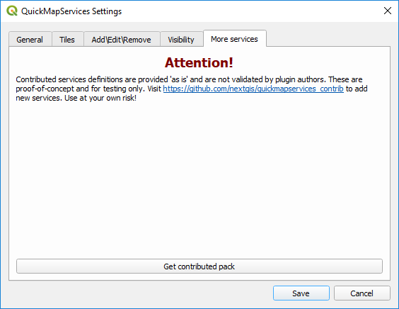

layout:true

  
  
QGIS for Working Professionals

  

    
    
      
      

--

class: center,middle

# Class Title

- - -

## Facilitator: Richard Dunks

### Follow along at: 

#### See the code at: 

<strong><strong>QGIS for Working Professionals</strong></strong> by <a xmlns:cc="http://creativecommons.org/ns#" href="https://www.datapolitan.com" property="cc:attributionName" rel="cc:attributionURL">Richard Dunks</a> is licensed under a <a rel="license" href="http://creativecommons.org/licenses/by-sa/4.0/">Creative Commons Attribution-ShareAlike 4.0 International License</a>

---

class:center,middle
# Welcome!

---

# A Few Ground Rules
???
+ Facilitators establish the intention we have for the culture of the classroom

--

+ Be present (phone, email, social media, etc.)
--

+ Be curious and ask questions
--

+ Step up, step back
--

+ One mic
--

+ Respect multiple perspectives 
--

+ Assume noble regard and positive intent

---

# Introductions
In pairs, please share with your partner:
+ Your name
+ What you do
+ Your level of comfort with QGIS (1 - 10)
+ What you hope to get from class this week

You'll be introducing your partner to the class (so take notes)

---

# Assumptions
--

+ You're all busy
--

+ You're all mostly self-taught
--

+ You're all motivated to learn how to better use QGIS
--

+ You all know your data better than I could (and might want to take a break from it)

---
class:center,middle

# How We're Going to Do This

---
# How I Teach
--

+ Minimal lecture
--

+ Demonstrate a concept/technique with open data
--

+ Learn by doing -> You'll be sharing your screen more than me
--

+ I ask a lot of you but I will help out along the way
--

+ I leave no one behind
--

---
# How our Days Are Going to Go
--

+ 2 85-minute sessions
--

+ 10-minute break in between
--

+ "Your Turn" -> Practice exercise towards end of each block
--

+ "Peer Mapping" -> Work in pairs with one person driving
--

+ "Homework" -> A 10-15 minute task to demo the next day
--

+ 1-hour open lab after our session is over for questions and additional help

---

# How the Week is going to look
--

+ **Monday** - Introduction to QGIS, loading data, filtering, and selecting
--

+ **Tuesday** - Projections, buffering features, spatial joins
--

+ **Wednesday** - Creating and editing features, validating geometries
--

+ **Thursday** - Georeferencing and a "Bonus" section

---

# Outcomes
--

At the end of this week, you will:
--

+ Understand foundational GIS concepts
--

+ Understand the purpose and functionality of a GIS
--

+ Be practiced using QGIS for a variety of spatial operations
--

+ Demonstrate proficiency in applying GIS concepts to real-world problems
--

+ Be familiar with key resources for further information on using QGIS

---

# Keep in Mind
--

+ We're going to start simple but will move quickly forward
--

+ I'll make sure it's interesting no matter your skill level
--

+ This is also an opportunity to help your colleagues

---

# Topics for Today
--

+ Basic operations in QGIS (loading, styling, filtering, and exporting data)
--

+ Essential GIS definitions and concepts
--

+ Pro-tips for working with QGIS

---
# Let's Get Started

## Download this data and unzip the file

???
Image of map we're going to create

---

# Let's Get Started

---

# Adding Data

???
1. Add Dallas Council districts
---

# Adding Data
--

+ Navigate to where you unzipped the file
--

+ Select the `.shp` file

--

+ Select .blue[Open]

---

# Adding Data

--

+ Select Add to add the data
--

+ Select Close

---

# Adding Data

---

# Attribute Table

---

# Attribute Table

---

# Attribute Table
+ Each feature has a corresponding row in the attribute table
--

+ When a feature is selected on the map, that row is selected in the attribute table
--

+ Features can be used to style the data

---

# Styling Features
--

+ Right click the layer and select "Properties"

---

# Styling Features
+ In the Layer Properties window, click the "Symbology" tab
--

+ Click the "Single Symbol" and select "Categorized" from the drop-down menu
--

---

# Styling Features
+ In the "Value" field, select the column that has the data you want to style
--

+ In our case, this is the "district" column
--

---

# Styling Features
+ Then click "Classify" (bottom left)
--

--

+ This should give each unique value in the column its own color

---

# Styling Features
+ Click "Ok" (or "Apply" to preview)

---
exclude:true
class:center,middle
# Let's See What You Have

---

# Add labels to data
--

+ In the Layer Properties window click the Labels tab
--

+ Select "Single labels"

---

# Add labels to data
--

+ Select the column that has the data you want to use for labels ("council")
--

+ Style the text however you want
--

---

# Add labels to data

---

# Your turn
--

Find a colleague to work with. One of you will "drive" while the other helps.
--

+ Style the polygons however you'd like
--

+ Change the outline color or add a pattern
--

+ Style the labels
--

+ Change the font, the font size, or other attributes (location)

---

class:center,middle
# What did we just do?

---

class:center,middle
# Some Basic Concepts

---

# Geographic Info System (GIS)
--

> Any system for capturing, storing, checking, and displaying data related to positions on the Earth's surface

### [National Geographic Education Encyclopedia](https://www.nationalgeographic.org/encyclopedia/geographic-information-system-gis/)

---

# Or more simply

> In a GIS, you connect _**data**_ with _**geography**_.

### [GISgeography.com](http://gisgeography.com/what-gis-geographic-information-systems/)

---

# Geographic Info Systems (GIS)
--

+ Create interactive queries (user-created searches)
--

+ Analyze spatial information
--

+ Edit data in maps
--

+ Present the results of all these operations

---

class:center,middle
# Some More Key Concepts

---

# Layers

#### Image Source: [Wikimedia Commons](https://commons.wikimedia.org/wiki/File:Visual_Representation_of_Themes_in_a_GIS.jpg)

---

# Basic Map Using QGIS

---

# Points  

--

---

# Lines

--

---

# Polygons

--

---

# Shapefiles
--
        
+ Basic file for storing map elements
--

+ Stores spatial data, like points, lines, and polygons
--

+ Multiple files comprise a "shapefile"

--

---

# Shapefiles

--

+ .shp—The main file that stores the feature geometry
--

+ .dbf—The dBASE table that stores the attribute information of features

---

# Shapefiles

+ .prj—The file that stores the coordinate system information
--

+ .shx—The index file that stores the index of the feature geometry

---

# You might also see
--

+ .cpg—Identifies the character set to be used
--

+ .sbn and .sbx—The files that store the spatial index of the features

---

# Shapefiles

+ Have a few limitations
--

+ One geometry type (Point, Line, Polygon) per shapefile
--

+ So sometimes you end up with this:

---

# Shapefiles
--

+ Column names can only be letters, numbers, and underscores "_"
--

+ Column names can only be ten characters long

--

---

# QGIS Pro-tip

+ Save your project
--

+ .red[QGIS doesn't autosave]
--

+ .red[You will lose work when it crashes]
--

---

# Your Turn
Working with a peer, come up with a basic map with one data layer.
--

+ Think about styling and labeling
--

+ Be ready to show the group
--

+ Feel free to get creative with what you show

---

name: a-block-end
class:center,middle

# Wrap-up

---
class:center
# 10-Minute Break

#### Source: https://www.instagram.com/sadtopographies/
---
name: b-block-start
class:center, middle

# Welcome Back

---

class:center,middle
# Let's add another layer

---

# What is a CSV file?
--

---

# What is a CSV file?

---

# Adding CSV Data

---

--

---

# Adding CSV Data

---

# Adding CSV Data

---

# Dallas 311 Service Requests
+ [Download the data](data/dot-311/20160201_20160207_DOT_311_ServiceRequests.zip) to your desktop
+ Unzip the file
+ Open in QGIS

---

# Dallas 311 Service Requests

---

class:center,middle
# What did we just do?

---

class:center,middle
# Some Basic Concepts

---

# Geographic Info System (GIS)
--

> Any system for capturing, storing, checking, and displaying data related to positions on the Earth's surface

### [National Geographic Education Encyclopedia](https://www.nationalgeographic.org/encyclopedia/geographic-information-system-gis/)

---

# Or more simply

> In a GIS, you connect _**data**_ with _**geography**_.

### [GISgeography.com](http://gisgeography.com/what-gis-geographic-information-systems/)

---

# Geographic Info Systems (GIS)
--

+ Create interactive queries (user-created searches)
--

+ Analyze spatial information
--

+ Edit data in maps
--

+ Present the results of all these operations

---

class:center,middle
# Some More Key Concepts

---

# Layers

#### Image Source: [Wikimedia Commons](https://commons.wikimedia.org/wiki/File:Visual_Representation_of_Themes_in_a_GIS.jpg)

---

# Basic Map Using QGIS

---

# Points  

--

---

# Lines

--

---

# Polygons

--

---

# QGIS Pro-tip

+ Save your project
--

+ .red[QGIS doesn't autosave]
--

+ .red[You will lose work when it crashes]
--

---

class: center, middle
# What is our Map missing?

---

exclude:true
# Base Maps

####Image Source: [Wikimedia Commons](https://commons.wikimedia.org/wiki/File:Visual_Representation_of_Themes_in_a_GIS.jpg)

---

# Base Maps

---

# Base Maps

+ Adding base maps will give your map context
--

+ In QGIS, you need a plugin to use base maps
--

+ There are several, but we're only going to use one of them

---

# Loading Base Maps in QGIS
+ From the Plugins menu, select "Manage and Install Plugins"

---

# Loading Base Maps in QGIS

+ Search for the QuickMapServices plugin and install it

---

# Setting Up QuickMapServices
+ Go to the Settings Menu

---

# Setting Up QuickMapServices

+ Get the contributed packs

---

# Setting Up QuickMapServices

+ Revel in all the beautiful base maps

---

class:center,middle
# Raise Your Hand When You Have All the Basemaps

---

# Loading Base Maps in QGIS
+ Take a moment and select the base map you want to use

---

# Loading Base Maps in QGIS

---
       
# Layer Ordering
--

+ Layers on top are drawn on top
--

+ Just drag and drop within the Layers Panel to change order
--

+ Try it now
---

# Filter and Query
+ We can filter the points based on the values in the attribute table

---
        
# Filter and Query
+ Right-click on the layer and select "Filter" to open the Query Builder

---

# Filter and Query

---

# Filter and Query

--

---

# Filter and Query

---

# Filter and Query

---

class:center,middle
# We can also filter by multiple conditions

---

# Multiple Conditions

--

---

# Multiple Conditions

---

# Select by Feature
???
(select noise complaints)

---

# Select by Location 
???
(select complaints in district)

---

# Zoom to Layer

---

# Zoom to Layer

---

# Zoom Selection
--

+ Select the zoom on the toolbar
--

--

+ Draw a box around the area you want to zoom into
--

+ Click the icon to return to the previous map extent
--

---

# Pan Map
+ Select the hand tool to pan around the map

quick tips (pan, zoom, zoom to layer)

---

# Panels and Toolbars

---

# Exporting Data

--

--- 

# Your Turn

---

# Homework
create and style a basic map with ERR data

---
class:center,middle
# Wrap-up

---

# Looking Ahead
--

+ Projections and why they're important
--

+ Buffering and selecting features
--

+ Spatial joins

---
name: b-block-end
class: center, middle

# Thank you!

---
class:center,middle

# Lab Time 

---

name: c-block-start
class: center,middle
# Welcome Back!

---

# A Few Ground Rules
???
+ Facilitators establish the intention we have for the culture of the classroom

--

+ Be present (phone, email, social media, etc.)
--

+ Be curious and ask questions
--

+ Step up, step back
--

+ One mic
--

+ Respect multiple perspectives 
--

+ Assume noble regard and positive intent

---
class:center, middle

# Homework presentations

---

# Topics for Today
--

+ Projections and why they're important
--

+ Buffering and selecting features
--

+ Spatial joins

---

# Projections

---

# Buffering and selecting features

---

# Your turn

---
name: c-block-end
class: center,middle

# Wrap-up

---

# 10-Minute Break

---
name: d-block-start
class: center,middle

# Welcome back

---

# Spatial Joins

---

# spatial join easy 
???
(join 311 to council districts)

---

# spatial join fail 
???
(something in Texas State plane)

---
# Your Turn
???
Putting it all together

---

# Homework
+ Create something that involves a spatial join
+ Show what you created and why you did it
+ Briefly describe how you did it

---
class:center,middle
# Wrap-Up

---

# Looking Ahead

---
name: d-block-end
class:center,middle
# Thank you!

---
class:center,middle

# Lab Time 

---
name: e-block-start
class:center,middle

# Welcome back!

---

# A Few Ground Rules
???
+ Facilitators establish the intention we have for the culture of the classroom

--

+ Be present (phone, email, social media, etc.)
--

+ Be curious and ask questions
--

+ Step up, step back
--

+ One mic
--

+ Respect multiple perspectives 
--

+ Assume noble regard and positive intent

---
class:center, middle
# Homework presentations

---

# creating and editing features

---

# Your turn

---
name: e-block-end
class: center,middle
# Wrap-Up

---
class:center,middle

# 10-min Break

---
name: f-block-start
class: center,middle
# Welcome back!

---

# Valid geometries

---

# Checking for valid geometries

---

# Fixing valid geometries

---

# Your turn
+ fix invalid geometries in shapefile

---

# Homework

---
class:center,middle
# Wrap-up
---

# Looking Ahead

---
name: f-block-end
class: center,middle

# Thank you!

---

name: g-block-start
class: center,middle
# Welcome back!

---

# A Few Ground Rules
???
+ Facilitators establish the intention we have for the culture of the classroom

--

+ Be present (phone, email, social media, etc.)
--

+ Be curious and ask questions
--

+ Step up, step back
--

+ One mic
--

+ Respect multiple perspectives 
--

+ Assume noble regard and positive intent

---
class:center,middle
# Homework presentations

---

# Topics for Today
--

+ Georeferencing
--

+ Your topics of interest

---

# Georeferencing

---

# Your Turn

---
name: g-block-end
class:center,middle
# Wrap-up

--- 
class:center,middle
# 10-Minute Break

---
name: h-block-start
class:middle,center

# Welcome Back!

---
name: h-block-end
class:center,middle

# Wrap-up

---

# Resources

---

# Final Thoughts

---

# Contact Information
+ [Email me](mailto:richard[at]datapolitan[dot]com)
+ Check out [my website](https://wwww.datapolitan.com)
+ Connect on [Twitter](https://twitter.com/Datapolitan)
+ Connect on [LinkedIn](https://www.linkedin.com/in/richarddunks/)
+ Follow us on [Instagram](https://www.instagram.com/datapolitan/)

---

class:middle,center
# Thank You!

